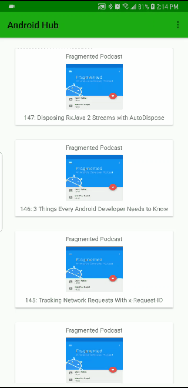

# AndroidHub
This is an app that plays recent episodes from my favorite Android podcast called "Fragmented" using a podcast API service

## Getting started
**GET YOUR API KEY FOR THIS APP AT:**
https://www.listennotes.com/api/

## Built with:

- Picasso - Handles image loading
- Retrofit - Handles communicating with the API service
- ExoPlayer - Plays audio and handles background audio via Service class
- Parceler - Made working with parcelable objects easier
- Timber - For simple logging convenience
- Lottie - Used for bookmark animation

This project is implemented using the MVVM app architecture with ROOM database, LiveData, and ViewModels.

## MediaStyle notification

The following GIF shows the notification and Exoplayer functionality which utilizes MediaSession class to stay in sync. You can see that when I click the Fast-Forward button in the MediaStyle notification, the run-time changes inside the notification and also in the Exoplayer controller inside the app. 

## Background audio and notification control

This GIF shows me navigating away from the app, but still having the audio play while the app is in the background. Although you can't hear the audio, you can see the playback progress in the notification controller. I can still control the audio while it's playing in the background with the notification controller and I can return to the app by pressing the center of the notification.

## ROOM database

I implemented a bookmarking feature using ROOM database. In the following GIF, you can see at the start of the GIF that there are no favorites, then I add two, and finally I remove one to show the UI responds immediately to the changes in the database.

